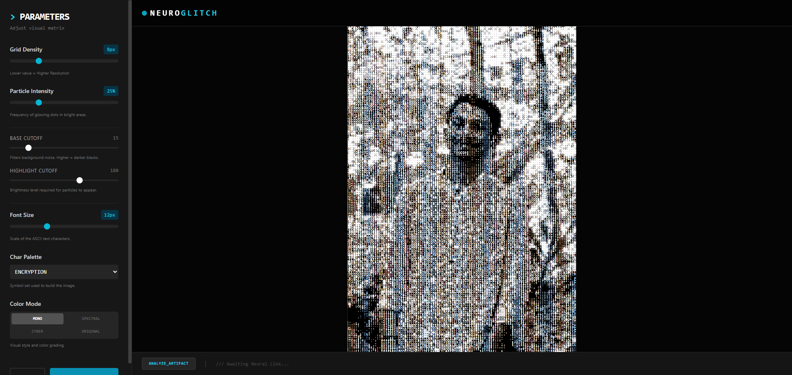
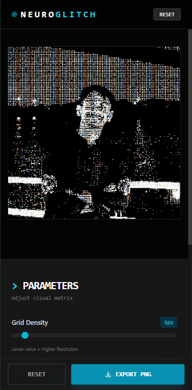
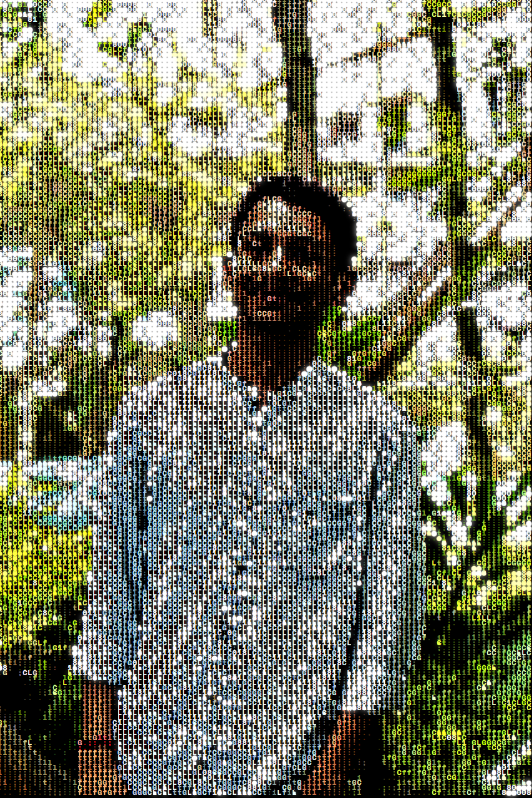

<div align="center">

</div>

# NeuroGlitch 🎨⚡

<div align="center">
  <h3>Transform images into stunning ASCII art with cyberpunk aesthetics</h3>
  <p>AI-powered image processor that converts photos into glitchy, neon-drenched ASCII masterpieces</p>
</div>

## 🌟 Features

- **ASCII Art Conversion**: Transform any image into pixel-perfect ASCII art with multiple character palettes
- **Real-time Processing**: Adjust parameters and see changes instantly on your canvas
- **AI Analysis**: Get cyberpunk-style interpretations of your creations using Gemini AI
- **Multiple Color Modes**: Choose from mono, spectral, cyber, or original color schemes
- **Particle Effects**: Add glowing particle overlays for that extra cyberpunk vibe
- **Responsive Design**: Works beautifully on desktop and mobile devices
- **Export Functionality**: Download your creations as high-quality PNG files

## 📸 Screenshots

### Desktop View


### Mobile View


### Example Output


## 🚀 Getting Started

### Prerequisites

- Node.js (v18 or higher recommended)
- A Gemini API key (optional, for AI analysis feature)

### Installation

1. Clone the repository:
```bash
git clone https://github.com/yourusername/neuroglitch.git
cd neuroglitch
```

2. Install dependencies:
```bash
npm install
```

3. Create a `.env.local` file in the root directory:
```env
GEMINI_API_KEY=your_gemini_api_key_here
```

4. Start the development server:
```bash
npm run dev
```

5. Open your browser and navigate to `http://localhost:3000`

## 🎛️ Controls

- **Grid Density**: Adjust the resolution of the ASCII grid (lower = higher resolution)
- **Particle Intensity**: Control the frequency of glowing particle effects
- **Base Cutoff**: Filter background noise and dark areas
- **Highlight Cutoff**: Set brightness threshold for particle appearance
- **Font Size**: Scale the ASCII character size
- **Char Palette**: Choose from encryption, standard, or complex character sets
- **Color Mode**: Switch between mono, spectral, cyber, or original color schemes

## 🛠️ Tech Stack

- **React 19** - UI framework
- **TypeScript** - Type safety
- **Vite** - Build tool and dev server
- **Tailwind CSS** - Styling
- **Google Gemini AI** - Image analysis
- **HTML5 Canvas** - Image processing and rendering

## 📝 Scripts

- `npm run dev` - Start development server
- `npm run build` - Build for production
- `npm run preview` - Preview production build

## 🔧 Configuration

The app uses environment variables for configuration. Create a `.env.local` file:

```env
GEMINI_API_KEY=your_api_key_here
```

**Note**: The AI analysis feature is optional. The app works perfectly without it, but you'll need the API key to use the "Analyze Artifact" feature.

## 📦 Project Structure

```
neuroglitch/
├── components/
│   ├── Controls.tsx      # Parameter controls panel
│   └── Dropzone.tsx      # Image upload component
├── services/
│   └── gemini.ts         # Gemini AI integration
├── utils/
│   └── imageProcessing.ts # Core ASCII conversion logic
├── App.tsx               # Main application component
├── types.ts              # TypeScript type definitions
└── vite.config.ts        # Vite configuration
```

## 🎨 Usage

1. **Upload an Image**: Drag & drop or click to browse for an image file
2. **Adjust Parameters**: Use the controls to fine-tune the visual output
3. **Export**: Click "EXPORT PNG" to download your creation
4. **Analyze**: Use "ANALYZE_ARTIFACT" to get an AI-powered interpretation

## 🤝 Contributing

Contributions are welcome! Please feel free to submit a Pull Request.

## 📄 License

This project is open source and available under the [MIT License](LICENSE).

## 🙏 Acknowledgments

- Built with React and Vite
- AI analysis powered by Google Gemini
- Font: Space Mono

---

<div align="center">
  Made with ⚡ and 🎨
</div>